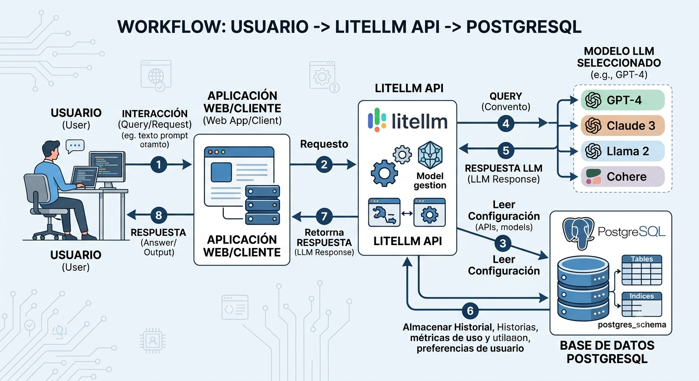

# 🤖 LiteLLM Local 🦙🐳
Local [LiteLLM](https://docs.litellm.ai/) proxy that exposes an OpenAI-compatible API and routes requests to [Ollama](https://ollama.com/) models on your machine.

Useful for tools that speak the OpenAI protocol (Cursor, scripts, HTTP clients) while pointing at local models instead of the cloud.

## 🔄 Workflow


The client sends an OpenAI-compatible request to the LiteLLM API, which reads its configuration and routes the prompt to the selected model. The response is returned to the client while usage history, metrics, and settings are persisted in PostgreSQL.

## 📋 Requirements
- [Docker](https://www.docker.com/) and Docker Compose
- [Ollama](https://ollama.com/) running on the host (port `11434`)
- At least one model pulled in Ollama:

```bash
ollama pull phi3:mini
ollama pull llama3.2:1b
ollama pull qwen2.5:1.5b
ollama pull gemma2:2b
```

## ⚙️ Configuration
The `config.yaml` file defines the exposed models and the Ollama connection.

### Available models

| API model             | Ollama backend        | Notes                          |
|-----------------------|-----------------------|--------------------------------|
| `llama3-local`        | `phi3:mini`           | Compact, good general use      |
| `llama3.2-1b-local`   | `llama3.2:1b`         | Very lightweight Meta model    |
| `qwen2.5-1.5b-local`  | `qwen2.5:1.5b`        | Strong quality for its size    |
| `gemma2-2b-local`     | `gemma2:2b`           | Balanced speed and quality     |

Use the **API model** name in requests (e.g. `"model": "qwen2.5-1.5b-local"`).

### General settings

| Parameter  | Default value                       |
|------------|-------------------------------------|
| Ollama URL | `http://host.docker.internal:11434` |
| Master key | Set in `config.yaml` (must start with `sk-`) |
| Port       | `4000`                              |

### 🐘 PostgreSQL
LiteLLM uses PostgreSQL to persist usage logs, API keys, and spend tracking.

| Parameter | Default value |
|-----------|---------------|
| Host      | `localhost` (port `5432`) |
| Database  | `litellm`     |
| User      | `llmproxy`    |
| Password  | `changeme`    |

Copy `.env.example` to `.env` and change the credentials before running in production:

```bash
cp .env.example .env
```

Edit `config.yaml` to add models, change the API key, or update the Ollama URL. Restart the proxy after changes:

```bash
docker compose restart litellm
```

## 🛠️ Commands
### ▶️ Start the stack
```bash
docker compose up -d
```

### 📜 View logs
```bash
docker compose logs -f litellm
docker compose logs -f db
```

### ⏹️ Stop the stack
```bash
docker compose down
```

### 🗄️ Connect to PostgreSQL
```bash
docker compose exec db psql -U llmproxy -d litellm
```

Once inside, list the LiteLLM tables and check the usage logs:

```sql
\dt
SELECT model, total_tokens, "startTime" FROM "LiteLLM_SpendLogs" ORDER BY "startTime" DESC LIMIT 5;
```

> **Windows / PowerShell:** passing `-c "..."` mangles the double quotes that LiteLLM's table names need. Pipe the query through stdin instead:
>
> ```powershell
> 'SELECT model, total_tokens, "startTime" FROM "LiteLLM_SpendLogs" ORDER BY "startTime" DESC LIMIT 5;' | docker compose exec -T db psql -U llmproxy -d litellm
> ```

### 💬 Test a chat request (PowerShell)
With the proxy and Ollama running:

```powershell
.\chat-try.ps1
```

The script sends a message to `http://localhost:4000/v1/chat/completions`. Change the `model` field in `chat-try.ps1` to use any available API model.

### 🌐 Test with curl
```bash
curl http://localhost:4000/v1/chat/completions \
  -H "Authorization: Bearer sk-1234" \
  -H "Content-Type: application/json" \
  -d "{\"model\": \"llama3-local\", \"messages\": [{\"role\": \"user\", \"content\": \"Hello\"}]}"
```

## 📁 Repository structure
| File               | Description                              |
|--------------------|------------------------------------------|
| `docker-compose.yml` | Runs LiteLLM and PostgreSQL              |
| `config.yaml`        | Models, master key, and LiteLLM settings |
| `.env.example`       | PostgreSQL credentials template          |
| `Dockerfile`         | Alternative image (manual build)         |
| `chat-try.ps1`       | Test script for Windows PowerShell       |
| `workflow.png`       | Architecture / request-flow diagram      |